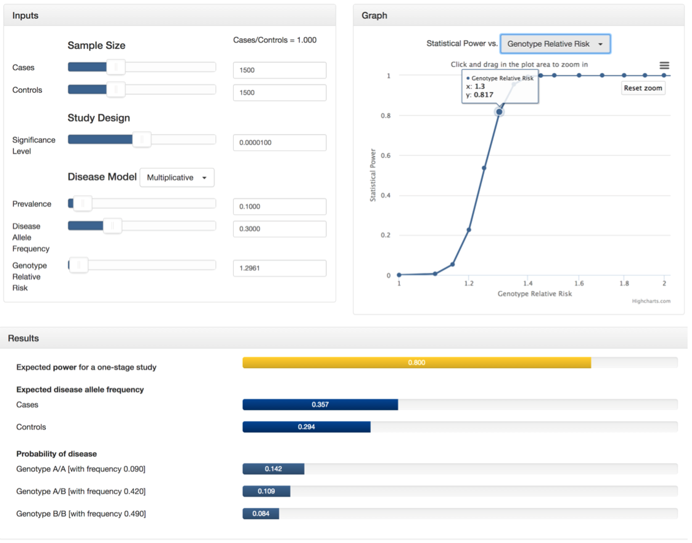

# GAS-power-calculator
This Genetic Association Study (GAS) Power Calculator is a simple interface that can be used to compute statistical power for large one-stage genetic association studies. The underlying method is derived from the [CaTS](http://csg.sph.umich.edu//abecasis/CaTS/index.html) power calculator for two-stage association studies (2006).

http://csg.sph.umich.edu/abecasis/gas_power_calculator/

## Authors
Web developer and designer: Jennifer Li Johnson

## Acknowledgements
Principal investigator: Dr. Goncalo Abecasis  
Web development support: Christopher Clark, Kevin Wei Li, and Sean Caron

Sponsored by University of Michigan School of Public Health Department of Biostatistics Center for Statistical Genetics  
Adapted from Dr. Andrew Skol's CaTS power calculator 2006

## Built With
* HTML
* CSS
* JavaScript
* Bootstrap 3
* Bootstrap Select
* noUiSlider
* Highcharts - v4.2.5
* jQuery - v1.10.2
* jQuery UI - v1.11.4
* Mathjax

## Getting Started
To investigate your genetic association study design, use the sliders and text boxes in the inputs section to select your parameters.  
Given your inputs, the calculated statistical power, expected disease allele frequencies, and probability of disease will be displayed in the results section.  
Change the independent variable at the top of the graphs section to visualize the change in power over the range of the selected parameter. All the other parameters remain as indicated in the inputs section. For the 'Cases + Controls' option indicating the total sample size, the ratio of cases to controls is specified by the calculation of 'Cases/Controls' in the inputs section.  
Click the menu at the top right hand side of graph to download plot and data.  

## Demo
The following is an example of how you could use the GAS Power Calculator.  
Suppose you are conducting a genome-wide association study with 1500 cases and 1500 controls. You plan to genotype these samples on 300,000 independent SNPs and are willing to tolerate a genome-wide false positive rate of 3. Therefore, your significance level will be 3/300000, or 0.00001. From previous studies, you know that the disease follows a multiplicative model and its prevalence is 0.10 with an allele frequency of 0.30 in the general population. Finally, you want determine the genotype relative risk that will result in a power of 0.80. To do this, you can select "Genotype Relative Risk" in the drop-down menu of the graph section and zoom in to see that a 0.80 power lies between a GRR of 1.295 and 1.3. At this point, use the GRR slider in the inputs section to estimate a more precise value (around GRR=1.2961). See the screenshots below or try it yourself!  
Of course this is not the only application. Play around with the input values and the independent variable in the graph section to see how they influence the power of the study and the additional output values in the results section.  

## Closing Thoughts
Tell us what you think! Let us know if you have any questions, comments, or catch any bugs and we'll get back to you as soon as we can.
Please email Jennifer at jenlij@umich.edu. Thank you!

## License 
Genetic Association Study (GAS) Power Calculator  
Copyright (C) 2017 Jennifer Li Johnson  
University of Michigan School of Public Health  
Department of Biostatistics Center for Statistical Genetics  

This program is free software: you can redistribute it and/or modify it under the terms of the GNU General Public License as published by the Free Software Foundation, either version 3 of the License, or (at your option) any later version.  

This program is distributed in the hope that it will be useful, but WITHOUT ANY WARRANTY; without even the implied warranty of MERCHANTABILITY or FITNESS FOR A PARTICULAR PURPOSE. See the GNU General Public License for more details.  
